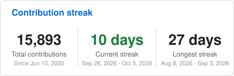

<h2 align="center">Hi there 👋 I'm Ran Tayar</h2>

  Full-stack web developer at <a href="https://github.com/Media-Maven-Tlv">@Media-Maven-Tlv</a>, based in Tel-Aviv 🇮🇱

  
  

### 🧠 Languages

  
  
  
  
  
  
  
  
  
  
  

### 🎨 Frontend

  
  
  
  
  
  
  
  
  
  
  
  
  
  
  
  
  
  
  

### ⚙️ Backend & CMS

  
  
  
  
  
  
  
  
  
  
  
  

### 🗄️ Databases & ORMs

  
  
  
  
  
  
  
  

### 🧪 Testing & Quality

  
  
  
  
  
  
  
  

### 🤖 AI & Automation

  
  
  
  
  
  
  
  
  

### 🔌 Integrations

  
  
  
  
  
  
  
  
  

### 🚀 DevOps & Tools

  
  
  <img src="https://img.shields.io/badge/AWS-232F3E?style=flat-square&logo=data:image%2Fsvg%2Bxml;base64,PHN2ZyBmaWxsPSJ3aGl0ZSIgcm9sZT0iaW1nIiB2aWV3Qm94PSIwIDAgMjQgMjQiIHhtbG5zPSJodHRwOi8vd3d3LnczLm9yZy8yMDAwL3N2ZyI%2BPHRpdGxlPkFtYXpvbiBBV1M8L3RpdGxlPjxwYXRoIGQ9Ik02Ljc2MyAxMC4wMzZjMCAuMjk2LjAzMi41MzUuMDg4LjcxLjA2NC4xNzYuMTQ0LjM2OC4yNTYuNTc2LjA0LjA2My4wNTYuMTI3LjA1Ni4xODMgMCAuMDgtLjA0OC4xNi0uMTUyLjI0bC0uNTAzLjMzNWEuMzgzLjM4MyAwIDAgMS0uMjA4LjA3MmMtLjA4IDAtLjE2LS4wNC0uMjM5LS4xMTJhMi40NyAyLjQ3IDAgMCAxLS4yODctLjM3NSA2LjE4IDYuMTggMCAwIDEtLjI0OC0uNDcxYy0uNjIyLjczNC0xLjQwNSAxLjEwMS0yLjM0NyAxLjEwMS0uNjcgMC0xLjIwNS0uMTkxLTEuNTk2LS41NzQtLjM5MS0uMzg0LS41OS0uODk0LS41OS0xLjUzMyAwLS42NzguMjM5LTEuMjMuNzI2LTEuNjQ0LjQ4Ny0uNDE1IDEuMTMzLS42MjMgMS45NTUtLjYyMy4yNzIgMCAuNTUxLjAyNC44NDYuMDY0LjI5Ni4wNC42LjEwNC45MTguMTc2di0uNTgzYzAtLjYwNy0uMTI3LTEuMDMtLjM3NS0xLjI3Ny0uMjU1LS4yNDgtLjY4Ni0uMzY3LTEuMy0uMzY3LS4yOCAwLS41NjguMDMxLS44NjMuMTAzLS4yOTUuMDcyLS41ODMuMTYtLjg2Mi4yNzJhMi4yODcgMi4yODcgMCAwIDEtLjI4LjEwNC40ODguNDg4IDAgMCAxLS4xMjcuMDIzYy0uMTEyIDAtLjE2OC0uMDgtLjE2OC0uMjQ3di0uMzkxYzAtLjEyOC4wMTYtLjIyNC4wNTYtLjI4YS41OTcuNTk3IDAgMCAxIC4yMjQtLjE2N2MuMjc5LS4xNDQuNjE0LS4yNjQgMS4wMDUtLjM2YTQuODQgNC44NCAwIDAgMSAxLjI0Ni0uMTUxYy45NSAwIDEuNjQ0LjIxNiAyLjA5MS42NDcuNDM5LjQzLjY2MiAxLjA4NS42NjIgMS45NjN2Mi41ODZ6bS0zLjI0IDEuMjE0Yy4yNjMgMCAuNTM0LS4wNDguODIyLS4xNDQuMjg3LS4wOTYuNTQzLS4yNzEuNzU4LS41MS4xMjgtLjE1Mi4yMjQtLjMyLjI3Mi0uNTEyLjA0Ny0uMTkxLjA4LS40MjMuMDgtLjY5NHYtLjMzNWE2LjY2IDYuNjYgMCAwIDAtLjczNS0uMTM2IDYuMDIgNi4wMiAwIDAgMC0uNzUtLjA0OGMtLjUzNSAwLS45MjYuMTA0LTEuMTkuMzItLjI2My4yMTUtLjM5LjUxOC0uMzkuOTE3IDAgLjM3NS4wOTUuNjU1LjI5NS44NDYuMTkxLjIuNDcuMjk2LjgzOC4yOTZ6bTYuNDEuODYyYy0uMTQ0IDAtLjI0LS4wMjQtLjMwNC0uMDgtLjA2NC0uMDQ4LS4xMi0uMTYtLjE2OC0uMzExTDcuNTg2IDUuNTVhMS4zOTggMS4zOTggMCAwIDEtLjA3Mi0uMzJjMC0uMTI4LjA2NC0uMi4xOTEtLjJoLjc4M2MuMTUxIDAgLjI1NS4wMjUuMzEuMDguMDY1LjA0OC4xMTMuMTYuMTYuMzEybDEuMzQyIDUuMjg0IDEuMjQ1LTUuMjg0Yy4wNC0uMTYuMDg4LS4yNjQuMTUxLS4zMTJhLjU0OS41NDkgMCAwIDEgLjMyLS4wOGguNjM4Yy4xNTIgMCAuMjU2LjAyNS4zMi4wOC4wNjMuMDQ4LjEyLjE2LjE1MS4zMTJsMS4yNjEgNS4zNDggMS4zODEtNS4zNDhjLjA0OC0uMTYuMTA0LS4yNjQuMTYtLjMxMmEuNTIuNTIgMCAwIDEgLjMxMS0uMDhoLjc0M2MuMTI3IDAgLjIuMDY1LjIuMiAwIC4wNC0uMDA5LjA4LS4wMTcuMTI4YTEuMTM3IDEuMTM3IDAgMCAxLS4wNTYuMmwtMS45MjMgNi4xN2MtLjA0OC4xNi0uMTA0LjI2My0uMTY4LjMxMWEuNTEuNTEgMCAwIDEtLjMwMy4wOGgtLjY4N2MtLjE1MSAwLS4yNTUtLjAyNC0uMzItLjA4LS4wNjMtLjA1Ni0uMTE5LS4xNi0uMTUtLjMybC0xLjIzOC01LjE0OC0xLjIzIDUuMTRjLS4wNC4xNi0uMDg3LjI2NC0uMTUuMzItLjA2NS4wNTYtLjE3Ny4wOC0uMzIuMDh6bTEwLjI1Ni4yMTVjLS40MTUgMC0uODMtLjA0OC0xLjIyOS0uMTQzLS4zOTktLjA5Ni0uNzEtLjItLjkxOC0uMzItLjEyOC0uMDcxLS4yMTUtLjE1MS0uMjQ3LS4yMjNhLjU2My41NjMgMCAwIDEtLjA0OC0uMjI0di0uNDA3YzAtLjE2Ny4wNjQtLjI0Ny4xODMtLjI0Ny4wNDggMCAuMDk2LjAwOC4xNDQuMDI0LjA0OC4wMTYuMTIuMDQ4LjIuMDguMjcxLjEyLjU2Ni4yMTUuODc4LjI3OS4zMTkuMDY0LjYzLjA5Ni45NS4wOTYuNTAyIDAgLjg5NC0uMDg4IDEuMTY1LS4yNjRhLjg2Ljg2IDAgMCAwIC40MTUtLjc1OC43NzcuNzc3IDAgMCAwLS4yMTUtLjU1OWMtLjE0NC0uMTUxLS40MTYtLjI4Ny0uODA3LS40MTVsLTEuMTU3LS4zNmMtLjU4My0uMTgzLTEuMDE0LS40NTQtMS4yNzctLjgxM2ExLjkwMiAxLjkwMiAwIDAgMS0uNC0xLjE1OGMwLS4zMzUuMDczLS42My4yMTYtLjg4Ni4xNDQtLjI1NS4zMzUtLjQ3OS41NzUtLjY1NC4yNC0uMTg0LjUxLS4zMi44My0uNDE1LjMyLS4wOTYuNjU1LS4xMzYgMS4wMDYtLjEzNi4xNzUgMCAuMzU5LjAwOC41MzUuMDMyLjE4My4wMjQuMzUuMDU2LjUxOC4wODguMTYuMDQuMzEyLjA4LjQ1NS4xMjcuMTQ0LjA0OC4yNTYuMDk2LjMzNi4xNDRhLjY5LjY5IDAgMCAxIC4yNC4yLjQzLjQzIDAgMCAxIC4wNzEuMjYzdi4zNzVjMCAuMTY4LS4wNjQuMjU2LS4xODQuMjU2YS44My44MyAwIDAgMS0uMzAzLS4wOTYgMy42NTIgMy42NTIgMCAwIDAtMS41MzItLjMxMWMtLjQ1NSAwLS44MTUuMDcxLTEuMDYyLjIyMy0uMjQ4LjE1Mi0uMzc1LjM4My0uMzc1LjcxIDAgLjIyNC4wOC40MTYuMjQuNTY3LjE1OS4xNTIuNDU0LjMwNC44NzcuNDRsMS4xMzQuMzU4Yy41NzQuMTg0Ljk5LjQ0IDEuMjM3Ljc2Ny4yNDcuMzI3LjM2Ny43MDIuMzY3IDEuMTE3IDAgLjM0My0uMDcyLjY1NS0uMjA3LjkyNi0uMTQ0LjI3Mi0uMzM2LjUxMS0uNTgzLjcwMy0uMjQ4LjItLjU0My4zNDMtLjg4Ni40NDctLjM2LjExMS0uNzM0LjE2Ny0xLjE0Mi4xNjd6TTIxLjY5OCAxNi4yMDdjLTIuNjI2IDEuOTQtNi40NDIgMi45NjktOS43MjIgMi45NjktNC41OTggMC04Ljc0LTEuNy0xMS44Ny00LjUyNi0uMjQ3LS4yMjMtLjAyNC0uNTI3LjI3Mi0uMzUxIDMuMzg0IDEuOTYzIDcuNTU5IDMuMTUzIDExLjg3NyAzLjE1MyAyLjkxNCAwIDYuMTE0LS42MDcgOS4wNi0xLjg1Mi40MzktLjIuODE0LjI4Ny4zODMuNjA3ek0yMi43OTIgMTQuOTYxYy0uMzM2LS40My0yLjIyLS4yMDctMy4wNzQtLjEwMy0uMjU1LjAzMi0uMjk1LS4xOTItLjA2My0uMzYgMS41LTEuMDUzIDMuOTY3LS43NSA0LjI1NC0uMzk5LjI4Ny4zNi0uMDggMi44MjYtMS40ODUgNC4wMDctLjIxNS4xODQtLjQyMy4wODgtLjMyNy0uMTUxLjMyLS43OSAxLjAzLTIuNTcuNjk1LTIuOTk0eiIvPjwvc3ZnPg%3D%3D" alt="AWS" />
  
  
  
  
  
  
  
  
  
  

---

  
  

  

  

