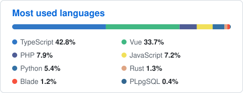

<h2 align="center">Hi there 👋 I'm Ran Tayar</h2>

  Web developer at <a href="https://github.com/Media-Maven-Tlv">@Media-Maven-Tlv</a>, based in Tel-Aviv 🇮🇱

  
  
  

  
  
  
  
  

---

  

  

  

