<h2 align="center">Hi there 👋 I'm Ran Tayar</h2>

  Full-stack web developer at <a href="https://github.com/Media-Maven-Tlv">@Media-Maven-Tlv</a>, based in Tel-Aviv 🇮🇱

  
  

### 🧠 Languages

  
  
  
  
  
  

### 🎨 Frontend

  
  
  
  
  
  
  
  
  
  

### ⚙️ Backend & CMS

  
  
  
  
  
  
  
  

### 🤖 AI & Automation

  
  
  
  
  
  

### 🚀 DevOps & Tools

  
  
  
  
  
  
  
  

---

  

  

  

